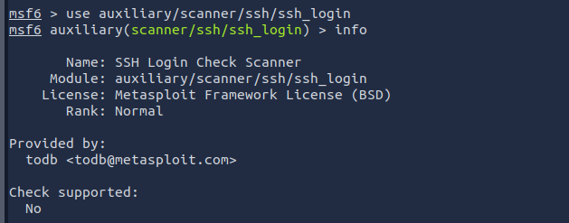

# 🛠️ Introduction to Metasploit – TryHackMe Room Write-Up
---

## 📘 Room Overview

**Room Name:** Introduction to Metasploit  
**Platform:** [TryHackMe](https://tryhackme.com/)  
**Category:** Blue Team / Pentesting  
**Difficulty:** Easy  
**Status:** ✅ Completed  
**Tools Covered:** `msfconsole`, `ssh_login`, payload selection, module parameters

---

## 🎯 Learning Objectives

- Understand the structure of Metasploit modules and their purposes
- Navigate and operate inside `msfconsole`
- Use key commands: `search`, `use`, `set`, `setg`, `show options`, `exploit`, and `sessions`
- Recognize different payload types (singles vs staged)
- Properly set context-specific vs global values in the console

---

## 🧠 My Thought Process

When going into this room, I was already fairly comfortable with Metasploit basics thanks to prior work on Hack The Box. That gave me a solid foundation to build from.

What stood out in this room was the **clean, structured flow** — from launching `msfconsole`, to understanding module types, to finally running an actual exploit. Even though this room was heavy on reading, it was justified by how expansive Metasploit truly is. This tool is a **powerhouse**, and I know I’ve barely scratched the surface.

One example of something I used from this experience was when I located the publisher of the `ssh_login` module. I simply ran:

```bash
use auxiliary/scanner/ssh/ssh_login
info
```

And the console displayed the author (todb@metasploit.com), license info, and rank.

I already knew most of the parameter commands like set and show options, but this room introduced me to:
- unset
- setg (global)
- unsetg

These will absolutely make working across multiple modules and targets cleaner and more efficient. Using setg for values like RHOSTS and LPORT saves time when switching contexts — a game-changer for more complex labs.

---

## 🔍 Key Takeaways
| Command    | Purpose     |
|------------|-------------|
| use [module] | Enter the context of a module |
| info |	View detailed info about a module |
| set |	Assign a parameter to the current context only |
| setg |	Assign a parameter globally across all contexts |
| unset |	Clear a set parameter |
| unset all |	Wipe all parameters in the current context |
| exploit -z |	Launch the exploit and background the session |
| sessions -i |	Interact with an active Meterpreter session |

---

## 📸 Screenshot



(This screenshot shows how I used use and info to gather module details, including the publisher.)

---

## 📦 Module Explored
- auxiliary/scanner/ssh/ssh_login
- exploit/windows/smb/ms17_010_eternalblue
- auxiliary/scanner/smb/smb_ms17_010
